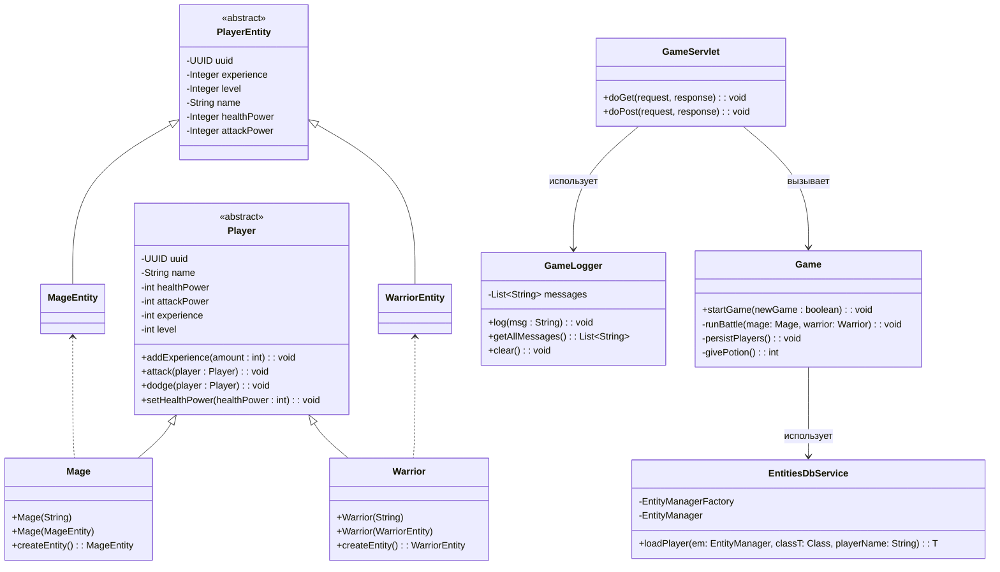

# 🎮 Консольная Игра → Веб-приложение 🚀


## 📑 Содержание

- [📖 Описание](#📖-описание)
- [🛠️ Технологии](#🛠️-технологии)
- [📂 Структура проекта](#📂-структура-проекта)
- [⚙️ Установка и запуск](#⚙️-установка-и-запуск)
- [💡 Использование](#💡-использование)
- [📊 Логирование](#📊-логирование)
- [🗺️ Диаграмма классов](#🗺️-диаграмма-классов)
- [🤝 Вклад](#🤝-вклад)
- [📄 Лицензия](#📄-лицензия)
- [📬 Контакты](#📬-контакты)

## 📖 Описание

Этот проект представляет собой преобразование консольной игры в веб-приложение с использованием **Java Servlets**, **Apache Tomcat**, **Hibernate/JPA** и **Log4j2**. В игре участвуют персонажи: **Маг** и **Воин**, которые сражаются друг с другом, набирая опыт и повышая уровень. Веб-интерфейс позволяет пользователям начать новую игру или продолжить сохранённую, а все действия и результаты отображаются на фронтенде.

## 🛠️ Технологии

- **Язык программирования:** Java 11 📝
- **Веб-сервер:** Apache Tomcat 🕸️
- **Фреймворк:** Java Servlets 🏗️
- **ORM:** Hibernate/JPA 🗄️
- **База данных:** H2 (для примера; можно заменить на другую) 🛢️
- **Логирование:** Log4j2 📜
- **Сборка:** Maven 📦
- **Фронтенд:** HTML, CSS, JavaScript (Fetch API) 🎨

## 📂 Структура проекта
```csharp
game_webapp/
│
├── .idea/                     # Конфигурация IDE (IntelliJ IDEA)
├── .smarttomcat/              # Настройки для плагина Smart Tomcat
├── db-scripts/                # SQL-скрипты для базы данных
├── logs/                      # Директория для логов приложения
├── src/
│   ├── main/
│   │   ├── java/
│   │   │   ├── org/
│   │   │   │   ├── sergei/
│   │   │   │   │   ├── game/
│   │   │   │   │   │   ├── DTOs/          # DTO (Data Transfer Objects)
│   │   │   │   │   │   │   ├── Mage.java
│   │   │   │   │   │   │   ├── Player.java
│   │   │   │   │   │   │   └── Warrior.java
│   │   │   │   │   │   ├── Entities/      # JPA-сущности
│   │   │   │   │   │   │   ├── MageEntity.java
│   │   │   │   │   │   │   ├── PlayerEntity.java
│   │   │   │   │   │   │   └── WarriorEntity.java
│   │   │   │   │   │   ├── logging/       # Логирование
│   │   │   │   │   │   │   └── GameLogger.java
│   │   │   │   │   │   ├── logic/         # Логика игры
│   │   │   │   │   │   │   └── Game.java
│   │   │   │   │   │   ├── serviceDb/     # Работа с базой данных
│   │   │   │   │   │   │   └── EntitiesDbService.java
│   │   │   │   │   │   └── web/           # Серверная часть (Servlets)
│   │   │   │   │   │       └── GameServlet.java
│   │   ├── resources/
│   │   │   ├── log4j2.xml                 # Конфигурация логирования Log4j2
│   │   │   ├── META-INF/
│   │   │   │   └── persistence.xml        # Конфигурация JPA
│   │   └── webapp/
│   │       ├── css/
│   │       │   └── style.css              # Стили для фронтенда
│   │       ├── images/                    # Директория для изображений
│   │       ├── js/
│   │       │   └── scripts.js             # Скрипты для фронтенда
│   │       ├── WEB-INF/
│   │       │   └── web.xml                # Конфигурация веб-приложения
│   │       └── index.html                 # Главная страница приложения
├── target/                   # Скомпилированные файлы (Maven)
├── .gitignore                # Исключения для Git
├── docker-compose.yml        # Конфигурация Docker Compose
├── pom.xml                   # Конфигурация Maven
└── README.md                 # Документация проекта

```
## ⚙️ Установка и запуск

### 📝 Предварительные требования

- **Java 21** или выше ☕
- **Maven** для сборки проекта 🛠️
- **Apache Tomcat** версии 9 или выше 🕸️

### 🛠️ Шаги установки

1. **Клонирование репозитория:**

    ```bash
    git clone https://github.com/javafullstackdeveloper2685/video_10_project_servlets.git
    cd game-webapp
    ```

2. **Сборка проекта с помощью Maven:**

    ```bash
    mvn clean package
    ```

   Это создаст WAR-файл в директории `target/`. 📦

3. **Настройка базы данных:**

   В данном проекте используется база данных **MySQL**, необходимо:

    - Добавить соответствующий драйвер в `pom.xml`. 🧰
    - Изменить настройки подключения в `persistence.xml`. 🔧

4. **Деплой на Apache Tomcat:**

    - Скопируйте файл `game-webapp.war` из директории `target/` в папку `webapps/` вашего Tomcat. 📂
    - Запустите Tomcat, если он ещё не запущен. ▶️

5. **Доступ к приложению:**

   Откройте браузер и перейдите по адресу: `http://localhost:8080/game-webapp/game` 🌐

## 💡 Использование

### 🖥️ Интерфейс

1. **Главная страница:**

   При заходе на страницу вы увидите две кнопки:

    - **Новая игра:** Создаёт новых персонажей и начинает игру. 🆕
    - **Продолжить игру:** Загружает сохранённых персонажей из базы данных и продолжает игру. 🔄

2. **Логи игры:**

   После выбора действия, внизу страницы появятся логи боя, отображающие каждое действие персонажей, нанесённый урон и результат сражения. 📝

### 🔍 Пример взаимодействия

1. Нажмите кнопку **"Новая игра"**. 🆕
2. Просмотрите логи, отображающие ход боя между Магом и Воином. ⚔️
3. По окончании игры данные персонажей сохраняются в базу данных. 💾
4. Вы можете вернуться на главную страницу и выбрать **"Продолжить игру"**, чтобы загрузить сохранённые данные и продолжить бой. 🔄

## 📊 Логирование

Проект использует **Log4j2** для логирования событий приложения. Все логируемые сообщения сохраняются как в консоль, так и в файл `logs/game.log`. 📜

### 🛠️ Конфигурация Log4j2

Файл конфигурации `log4j2.xml` находится в папке `src/main/resources/` и содержит настройки для консольного и файлового аппендеров.

```xml
<?xml version="1.0" encoding="UTF-8"?>
<Configuration status="WARN">
    <Appenders>
        <!-- Консольный аппендер -->
        <Console name="Console" target="SYSTEM_OUT">
            <PatternLayout pattern="%d{yyyy-MM-dd HH:mm:ss} [%t] %-5level %logger{36} - %msg%n"/>
        </Console>

        <!-- Файловый аппендер -->
        <File name="FileLogger" fileName="logs/game.log">
            <PatternLayout>
                <pattern>%d{yyyy-MM-dd HH:mm:ss} [%t] %-5level %logger{36} - %msg%n</pattern>
            </PatternLayout>
        </File>
    </Appenders>

    <Loggers>
        <!-- Логгер для вашего приложения -->
        <Logger name="com.yourcompany.game" level="debug" additivity="false">
            <AppenderRef ref="Console"/>
            <AppenderRef ref="FileLogger"/>
        </Logger>

        <!-- Корневой логгер -->
        <Root level="error">
            <AppenderRef ref="Console"/>
        </Root>
    </Loggers>
</Configuration>
```
**Примечание**: Замените `com.yourcompany.game` на пакет вашего приложения. Это позволит логировать только из вашего приложения в указанные аппендеры. 📂

## 🗺️ Диаграмма классов



### Объяснение :

* ``Player`` — абстрактный класс, от которого наследуются ``Mage`` и ``Warrior``. 🧙‍♂️🗡️
* ``PlayerEntity`` — абстрактная сущность JPA, от которой наследуются ``MageEntity`` и ``WarriorEntity``. 🗃️
* ``Mage`` и ``Warrior`` имеют методы для конвертации в сущности JPA (``createEntity()``). 🔄
* Game управляет логикой игры и использует ``EntitiesDbService`` для взаимодействия с базой данных. 🎮
* ``GameLogger`` аккумулирует логи игры и взаимодействует с **Log4j2**. 📜
* `GameServlet` взаимодействует с фронтендом и вызывает методы из `Game`. 🌐

## 🤝 Вклад
Приветствуются любые предложения и улучшения! Пожалуйста, создавайте issues для обсуждения ошибок или новых фич, а также отправляйте pull requests с вашими изменениями. 📝✨

## 📄 Лицензия
Этот проект лицензирован под лицензией MIT. 📜

## 📬 Контакты
Если у вас есть вопросы или предложения, вы можете связаться со мной:

* **Email**: javafullstackdeveloper2685@gmail.com 📧
